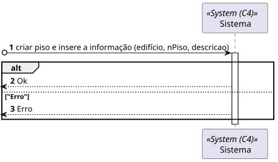
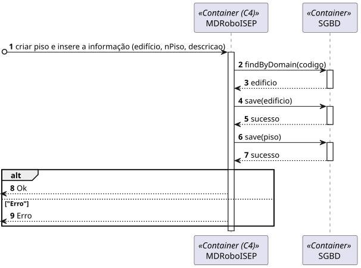
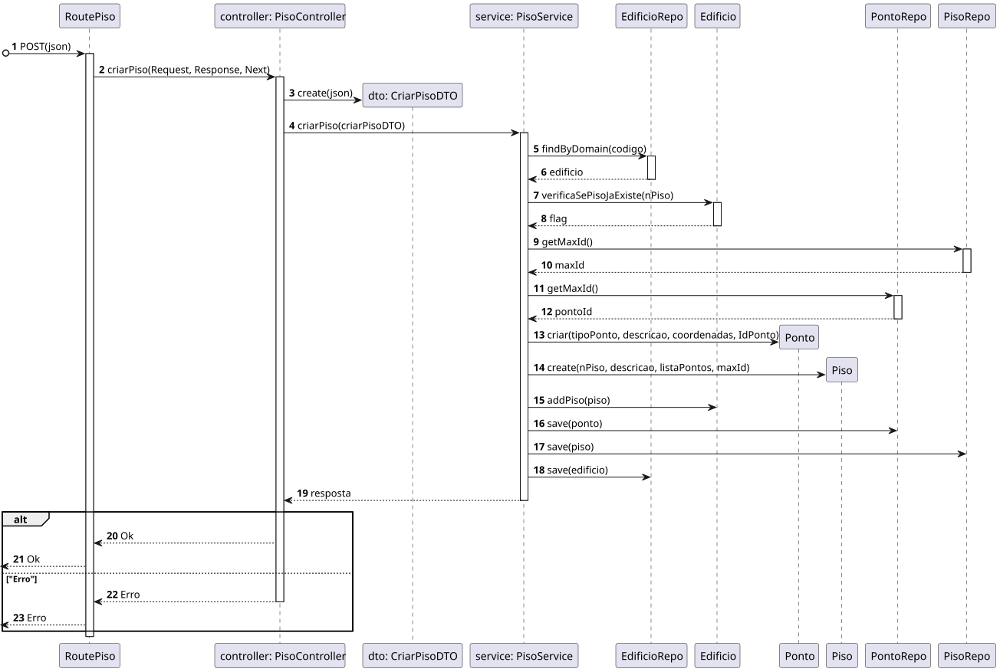

# US 290 - 	Criar piso de edifício


## 1. Context

É a vez primeira que está a ser desenvolvida.
O Gestor de Campus quer criar um piso do edificio.

## 2. Requirements

**Main actor**

* Gestor de Campus

**Interested actors (and why)**

* Gestor de Campus : quer criar um piso para um edifício.

**Pre conditions**

* O edifício tem de estar criado.

**Post conditions**

* O piso criado tem de estar persistido

**Main scenario**
1.  Gestor de Campus quer criar piso e insere a informação (edifício, número do piso, descrição do piso) 
2. Sistema diz se a operação foi um sucesso 


**Other scenarios**

**5.a.** O sistema verifica se o piso já existe
1. Avisa que o piso já existe
2. Termina a use case

**5.b.** O sistema verifica se o edifício existe
1. Avisa que o edifício já existe
2. Termina a use case


## 3. Analysis

**Esclarecimentos do cliente:** </br>

> **Questão:** </br>
Boa tarde, caro cliente.
É esperado que seja imposto um limite aquando da criação de um piso? Ex: 0 <= andar piso <= 100, De forma a evitar valores irrealistas.</br>
Relativamente à breve descrição, referida em: https://moodle.isep.ipp.pt/mod/forum/discuss.php?d=25016, existirá alguma restrição quanto ao comprimento da mesma, como é o caso da descrição do edifício?</br>
Cumprimentos.</br>
G05.</br>
**Resposta:** </br>
bom dia,
não existem limites. podem existir pisos subteraneos, ex., piso -1.
a breve descrição é opcional e no máximo terá 250 caracteres


Relevant DM excerpt



## 4. Design

### 4.1. Nível 1

#### 4.1.1 Vista de processos



#### 4.1.2 Vista FÍsica


#### 4.1.3 Vista Lógica


#### 4.1.4 Vista de Implementação

N/A (Não vai adicionar detalhes relevantes)

### 4.2 Nível 2

#### 4.2.1 Vista de processos



#### 4.2.2 Vista FÍsica


#### 4.2.3 Vista Lógica


#### 4.2.4 Vista de Implementação


### 4.3. Nível 3 

#### 4.3.1 Vista de processos




#### 4.3.2 Vista FÍsica

N/A (Não vai adicionar detalhes relevantes)

#### 4.3.3 Vista Lógica


#### 4.3.4 Vista de Implementação


### 4.4. Tests

**Test 1:** **

```
```

## 5. Implementation
Here are some samples of the implementation:

1. Method buildCourse() from CourseFactory
```
```

## 6. Observations
N/A