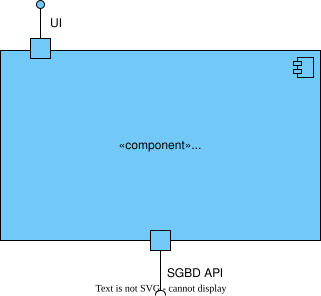
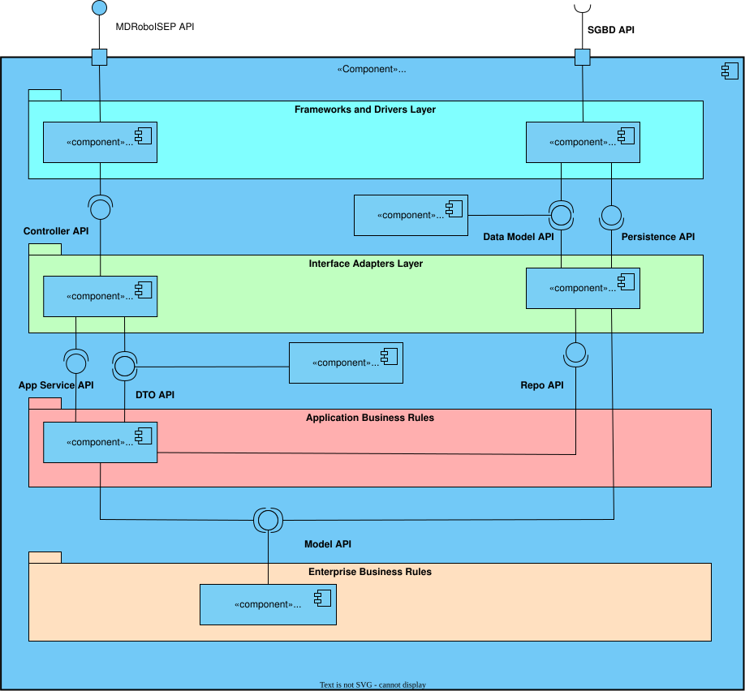
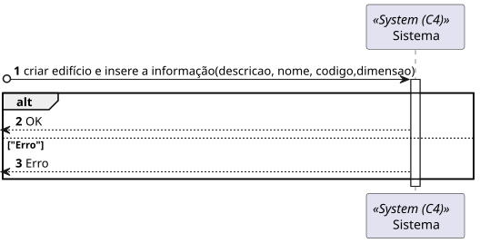
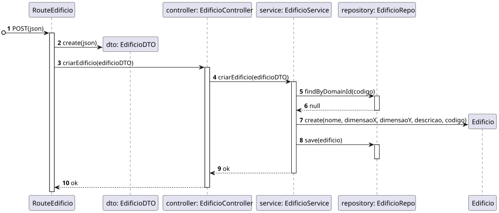
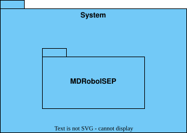
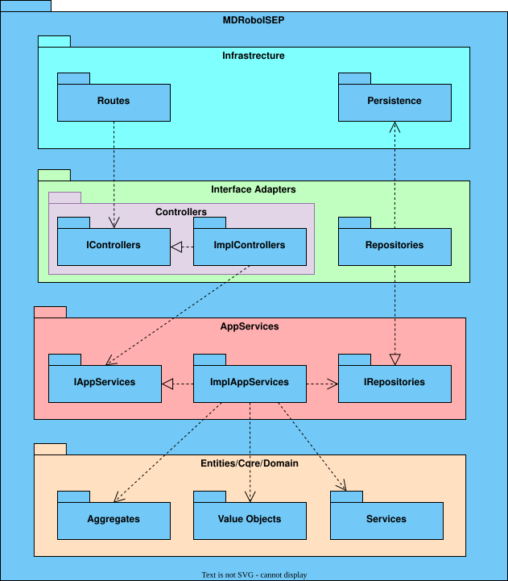
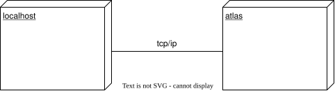
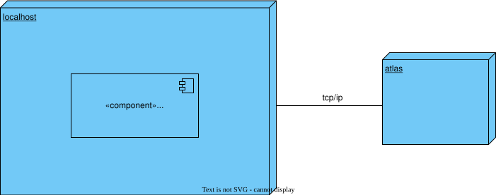

# 150 - Criar Edifício

## 1. Contexto


It is the first time the task is assigned to be developed.


## 2. Requisitos
* 150 - Criar Edifício

## 2. Análise

**Ator Principal**

* Gestor de Campus

**Atores Interessados (e porquê?)**

* Gestor de Campus

**Pré-condições**

* N/A

**Pós-condições**

* O Edifício será presistido

**Cenário Principal**

1. É inserida a informação sobre o Edifício (Descrição, Nome, Código e Dimensão)
2. O sistema informa do sucesso ou do insucesso
   
### Questões relevantes ao cliente

>**Aluno:**</br>Caro cliente,</br>Relativamente à criação de edifícios é suposto criar-mos um edifício sem nenhum piso inicialmente e depois adicionarmos os pisos?</br>Por exemplo: Criar o edifício A apenas, sem nenhum piso, e só depois na US 190 criar-mos os respetivos pisos do edifício A.</br>Ou é necessário sempre que criarmos um edifício especificar os pisos que o mesmo tem?</br>Por exemplo: Criar o edifício A, com os pisos A1, A2, A3 com as dimensões da grelha para cada um dos pisos.</br>Os melhores cumprimentos,</br>Grupo 002.</br>**Cliente:**</br>boa tarde,</br>são dois requisitos independentes. 150 apenas define o edificio. posteriormente o utilizador invocará o caso de uso correspondete ao requisito 190 para criar cada piso desse edificio


>**Aluno:**</br>Caro cliente,</br>O nome do edifício tem limitações como, por exemplo, tem de ter uma letra e números? E para além do nome do edifício, que mais informação deve ser guardada sobre o edifício.</br></br>Obrigado pela sua atenção,</br>Grupo 3.</br></br>**Cliente:** </br>boa tarde</br>ver https://moodle.isep.ipp.pt/mod/forum/discuss.php?d=25016#p31679</br>o código do edificio é obrigatório, no máximo 5 caracteres, letras e digitos, podendo conter espaços no meio</br> nome do edificio é opcional, no máximo 50 caracteres alfanuméricos</br></br>**Aluno:**</br>Em relação à breve descrição, existe alguma regra em particular?</br></br>**Cliente:**</br>bom dia</br>é opcional, com o máximo de 255 caracteres


### Excerto Relevante do Domínio


## 3. Design
### 3.1.1 Vista Lógica
**Nível 1**




**Nível 2**



**Nível3**



### 3.1.2. Vista de Processos
**Nível 1**

**Nível 3**

### 3.1.3 Vista de Implementação

**Nível 2**



**Nível 3**



### 3.1.3 Vista Física

**Nível 1**



**Nível 2**



### 3.2. Testes

## 4. Implementação
Alguns exemplos de implementação:
````
````

Resumo de commits sobre a implementação:

## 5. Observations
N/A