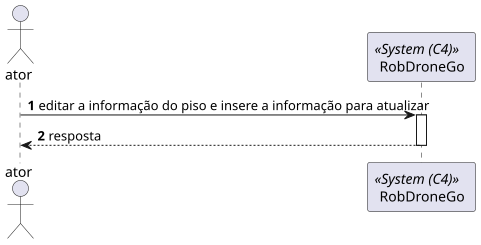
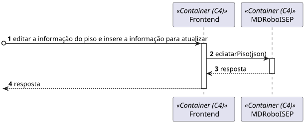
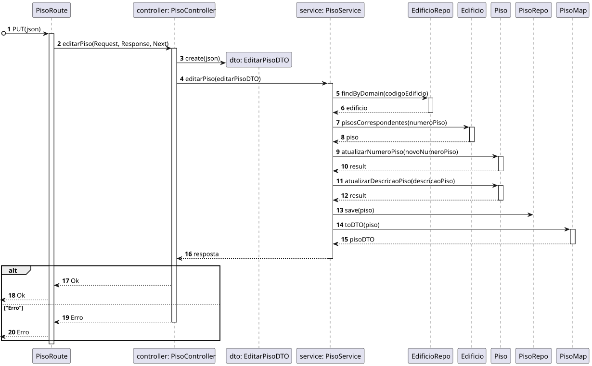
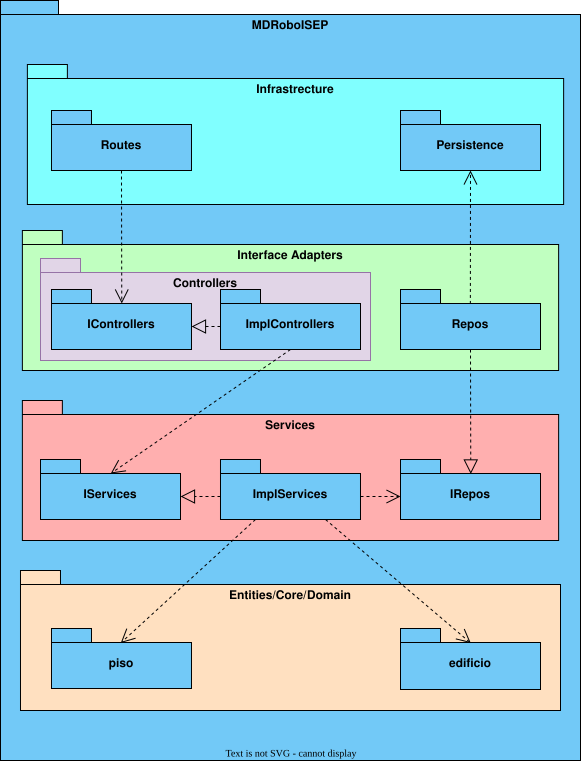

# US 200 - 	Editar informação de piso de edifício


## 1. Context

É a vez primeira que está a ser desenvolvida.
Quer editar a informação do piso

## 2. Requirements

**Main actor**

* N/A

**Interested actors (and why)**

* N/A

**Pre conditions**

* O piso tem de já estar criado

**Post conditions**

* O piso criado tem de estar persistido

**Main scenario**
1. Quer editar a informação do piso e insere a informação para atualizar
2. Sistema diz se a operação foi um sucesso 


**Other scenarios**

**5.a.** O sistema verifica se o edifício NÃO existe
1. Avisa que o edifício não existe
2. Termina a use case

**5.b.** O sistema verifica se o piso não existe
1. Avisa que o piso não existe
2. Termina a use case


## 3. Analysis

**Esclarecimentos do cliente:** </br>

> **Questão:** </br>
Caro cliente,</br>
Em relação às User Stories de edição, temos já uma ideia das informações que são opcionais, mas queremos ter a certeza daquilo que é editável ou não. </br>Posto isto, poderia indicar que informações pretende editar nas US160, US200, US250 e US280?</br>
Obrigado pela atenção,</br>
Grupo 77.</br>
**Resposta:** </br>
bom dia </br>
(...)</br>
requisito 200 - editar piso - todas as informações à exceção do edificio a que o piso se refere</br>
(...)</br>


Relevant DM excerpt



## 4. Design

### 4.1. Nível 1

#### 4.1.1 Vista de processos



#### 4.1.2 Vista FÍsica

N/A (Não vai adicionar detalhes relevantes)

#### 4.1.3 Vista Lógica


#### 4.1.4 Vista de Implementação

N/A (Não vai adicionar detalhes relevantes)

#### 4.1.4 Vista de Cenarios


### 4.2 Nível 2

#### 4.2.1 Vista de processos



#### 4.2.2 Vista FÍsica


#### 4.2.3 Vista Lógica


#### 4.2.4 Vista de Implementação


### 4.3. Nível 3 

#### 4.3.1 Vista de processos




#### 4.3.2 Vista FÍsica

N/A (Não vai adicionar detalhes relevantes)

#### 4.3.3 Vista Lógica


#### 4.3.4 Vista de Implementação




### 4.4. Tests

**Test 1:** **

```
```

## 5. Observations
N/A