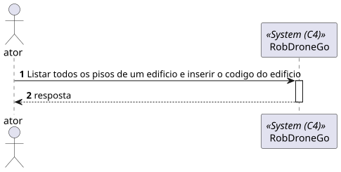
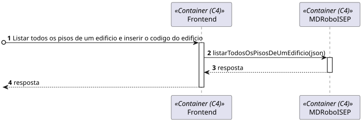
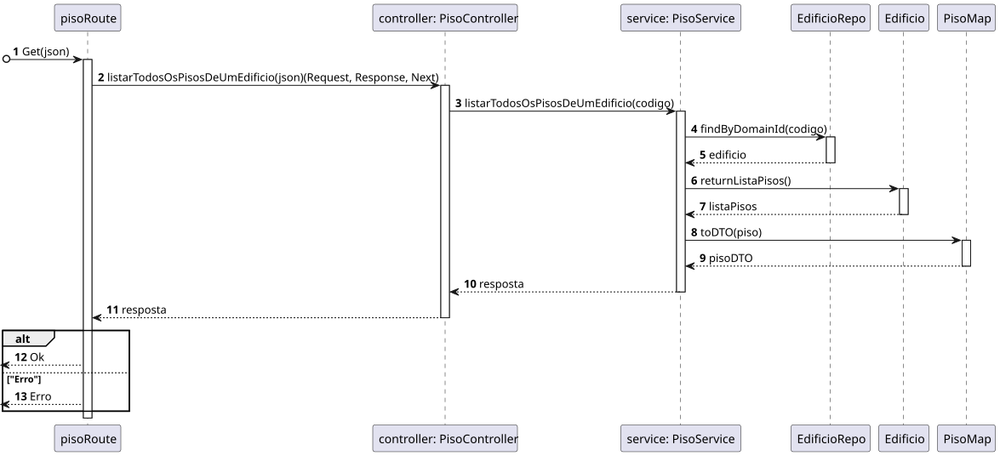
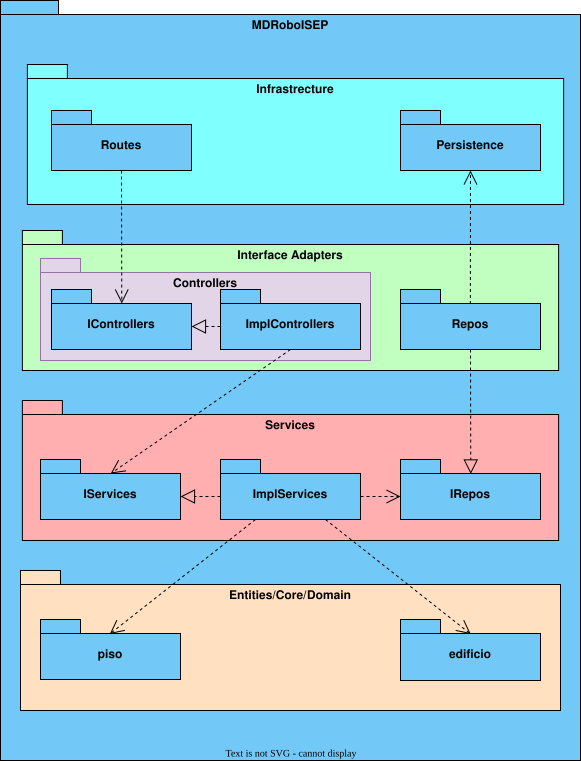

# US 210 - 	Listar todos os pisos de um edifício	


## 1. Context

É a vez primeira que está a ser desenvolvida.

## 2. Requirements

**Main actor**

* N/A

**Interested actors (and why)**

* N/A

**Pre conditions**

* Tem de existir o edificio

**Post conditions**

* Tem de ser listado todos os pisos de um edificio

**Main scenario**
1. Listar todos os pisos de um edificio e inserir o codigo do edificio
2. Sistema retorna uma lista de pisos

**Other scenarios**

**a.** O sistema verifica que o edificio não existe
1. Avisa que o edificio nao existe

## 3. Analysis

Relevant DM excerpt


## 4. Design

### 4.1. Nível 1

#### 4.1.1 Vista de processos



#### 4.1.2 Vista FÍsica

N/A (Não vai adicionar detalhes relevantes)

#### 4.1.3 Vista Lógica


#### 4.1.4 Vista de Implementação

N/A (Não vai adicionar detalhes relevantes)

#### 4.1.5 Vista de Cenarios


### 4.2 Nível 2

#### 4.2.1 Vista de processos



#### 4.2.2 Vista FÍsica


#### 4.2.3 Vista Lógica


#### 4.2.4 Vista de Implementação


### 4.3. Nível 3 

#### 4.3.1 Vista de processos




#### 4.3.2 Vista FÍsica

N/A (Não vai adicionar detalhes relevantes)

#### 4.3.3 Vista Lógica


#### 4.3.4 Vista de Implementação




### 4.4. Tests

**Test 1:** **

```
```


## 5. Observations
N/A