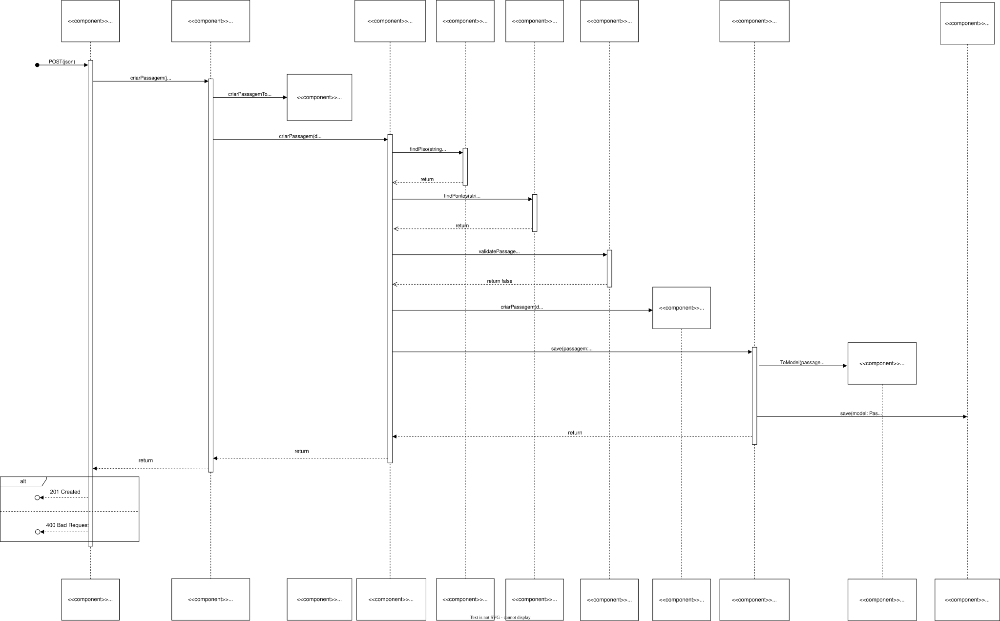

# Documentação de Análise e Design da User Story

- **ID da User Story**: 240 
- **Sprint**: A
- **Responsável**: David Dias

## Índice

1. [Descrição da User Story](#descrição-da-user-story)
2. [Criterios de Aceitação](#criterios-de-aceitação)  
3. [Requisitos](#requisitos)  
    2.1. [Funcionais](#funcionais)  
    2.2. [Não Funcionais](#não-funcionais)
4. [Padrões Utilizados](#padrões-utilizados)
5. [Design](#design)
6. [Código de Exemplo](#código-de-exemplo)
7. [Testes](#testes)

## Descrição da User Story

> Como um administrador de sistema da gestão do Campus, quero ser capaz de criar passagens entre diferentes edifícios para facilitar a circulação de pessoas e o acesso a diferentes serviços ou instalações.

## Criterios de Aceitação

- O sistema deve fornecer uma interface onde o administrador possa selecionar dois pisos de edificios diferentes que sejam existentes no sistema e criar uma passagem entre eles.
- O sistema deve validar se os pisos selecionados são elegíveis para uma passagem (por exemplo, se existem no sistema ou se não possuem já uma passagem entre si registada).
- O sistema deve permitir que o administrador especifique em que posição está localizada a passagem.
- Uma vez criada, a passagem deve ser visível em qualquer representação gráfica ou listagem.
- O sistema deve fornecer uma opção para o administrador editar passagens existentes.

## Requisitos

### Funcionais
- RF1: Implementar um método que permita a criação de uma passagem entre dois pisos de edificios diferentes.
- RF2: Implementar um método que permita a validação de passages existentes no piso 

### Não Funcionais

- RFN1: O sistema deve ser capaz de processar a criação de uma nova passagem em menos de 2 segundos, garantindo uma experiência de usuário ágil.

- RFN2: Apenas administradores autenticados devem ter permissão para criar, editar ou visualizar passagens entre edifícios.

- RFN3: A interface para criar passagens deve ser intuitiva e requerer não mais do que três etapas para completar a ação.

- RFN4 O sistema tem que ser capaz de processar multiplas requisições de criação de passagens em simultâneo.

- RFN5 Todas as transações que envolvem a criação ou edição de passagens devem ser atómicas para manter a integridade dos dados.

- RFN6 A funcionalidade de criação de passagens deve ser acessível em diferentes sistemas operativos e navegadores web.
Localização e Internacionalização:

## Padrões Utilizados

### Padrões de Design e Princípios:
- SOLID: Os princípios SOLID serão seguidos para garantir um código orientado a objetos bem projetado e de fácil manutenção.

- GRASP: Os padrões GRASP serão aplicados para melhorar a coesão e reduzir o acoplamento entre os componentes do sistema.

- Gang of Four: Padrões de design clássicos como Factory serão considerados, conforme apropriado, para resolver problemas de design específicos.

### Arquitetura:
- Clean Architecture: Será adotada para separar as responsabilidades e tornar o sistema mais testável e manutenível.

- Onion Architecture: Utilizada em conjunto com a Clean Architecture para garantir que a lógica de domínio seja o centro do design do sistema.

### Documentação e Modelagem:
- Modelo C4: Utilizado para a documentação arquitetural, facilitando a compreensão da estrutura e do comportamento do sistema tanto para as equipas técnicas quanto para as partes interessadas.

## Design

A documentação foi estruturada em três níveis de granularidade e quatro vistas diferentes.

### Nivel de Granularidade 1:

#### Vista Lógica: 

Esta vista encontra-se localizada numa pasta mais abrangente, pois é comum a todas as User Stories. 

  
*Vista lógica nível 1 - Diagrama de classes* 

Para ver as imagens com mais detalhe consulte o ficheiro [Nível 1](../N1)


#### Vista de Processo: 

Nesta vista podemos ver a sequência que representa o processo de criação de uma passagem entre dois pisos de edifícios diferentes.

  
*Vista de Processos nível 1 - Diagrama de sequência*  

Para ver as imagens com mais detalhe consulte o ficheiro [Nível 1](N1)

#### Vista de Implementação: 

Esta vista é obviada no nível de granularidade 1 pois não é relevante para o design do sistema e não acrescenta valor à documentação.

#### Vista Física: 

Esta vista é obviada no nível de granularidade 1 pois não é relevante para o design do sistema e não acrescenta valor à documentação.

### Nivel de Granularidade 2:

#### Vista Lógica: 

Esta vista encontra-se localizada numa pasta mais abrangente, pois é comum a todas as User Stories. 

  
*Vista lógica nível 2 - Diagrama de classes* 

Para ver as imagens com mais detalhe consulte o ficheiro [Nível 2](../N2)

#### Vista de Processo: 

Nesta vista já encontramos mais informação relevante a esta US em específico, neste caso é a sequência que representa o processo de criação de uma passagem entre dois pisos de edifícios diferentes entre o sistema e a base de dados.

  
*Vista de Processos nível 1 - Diagrama de sequência*  

Para ver as imagens com mais detalhe consulte o ficheiro [Nível 2](N2)


#### Vista de Implementação: 

Esta vista encontra-se localizada numa pasta mais abrangente, pois é comum a todas as User Stories.

  
*Vista de Implementação nível 2 - Diagrama de pacotes*   

Para ver as imagens com mais detalhe consulte o ficheiro [Nível 2](N2)

#### Vista Física: 

Esta vista encontra-se localizada numa pasta mais abrangente, pois é comum a todas as User Stories. 

  
*Vista Física nível 2 - Diagrama de deployment*

Para ver as imagens com mais detalhe consulte o ficheiro [Nível 2](../../N2/VL.svg)

### Nivel de Granularidade 3:

#### Vista Lógica: 

Esta vista encontra-se localizada numa pasta mais abrangente, pois é comum a todas as User Stories. 

  
*Vista lógica nível 3 - Diagrama de classes* 

Para ver as imagens com mais detalhe consulte o ficheiro [Nível 3](../N3)

#### Vista de Processo: 

Nesta vista já encontramos mais informação relevante a esta US em específico, neste caso é a sequência que representa o processo de criação de uma passagem entre dois pisos de edifícios diferentes entre os diferentes componentes do sistema e a base de dados.

  
*Vista de Processos nível 3 - Diagrama de sequência*  

Para ver as imagens com mais detalhe consulte o ficheiro [Nível 3](N3)

#### Vista de Implementação: 

Esta vista encontra-se localizada numa pasta mais abrangente, pois é comum a todas as User Stories.

  
*Vista de Implementação nível 2 - Diagrama de pacotes*   

Para ver as imagens com mais detalhe consulte o ficheiro [Nível 3](N3)

#### Vista Física: 

Esta vista é obviada no nível de granularidade 3 pois não é relevante para o design do sistema e não acrescenta valor à documentação.

## Código de Exemplo

```typescript
// Exemplo de código TypeScript
```

## Testes

> Descreva os testes realizados, incluindo testes unitários, de integração e outros.

