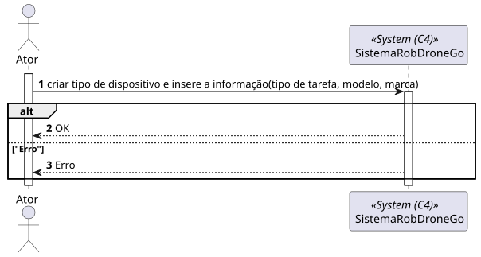
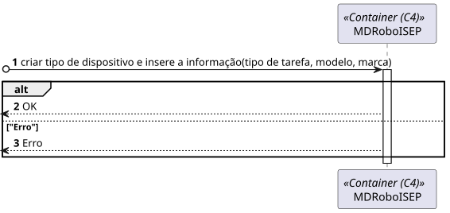
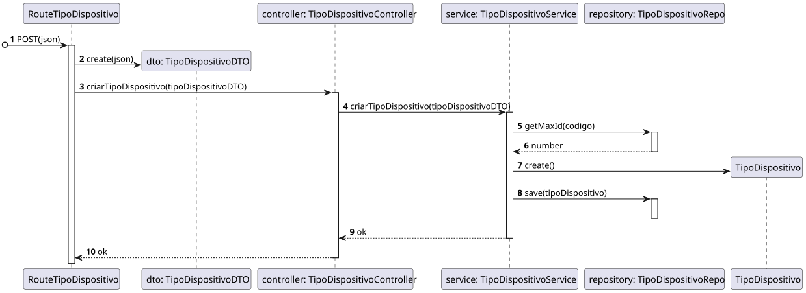

# 350 - Como gestor de frota pretendo adicionar um novo tipo de robot 

## 1. Contexto


É a primeira vez que esta US está a ser desenvolvida.


## 2. Requisitos
* 350 - Como gestor de frota pretendo adicionar um novo tipo de robot indicando a sua designação e que tipos de tarefas pode executar da lista prédefinida de tarefas

## 2. Análise

**Ator Principal**

* Gestor de frota

**Atores Interessados (e porquê?)**

* Gestor de frota

**Pré-condições**

* N/A

**Pós-condições**

* O tipo de dispositivo será presisitido

**Cenário Principal**

1. É inserida a informação sobre o Tipo de Dispositivo (Tipo de Tarefa, Modelo, Marca)
2. O sistema informa do sucesso ou do insucesso
   
### Questões relevantes ao cliente

>**Aluno:**</br>Bom dia,</br>Relativamente à US350 foi referido numa resposta anterior "o requisito 350 permite definir que tipos de robots existem. por exemplo "Tipo A: Robot marca X modelo Y com capacidade de executar tarefas de vigilância"</br>Pretende alguma regra de negócio para o limite de caracteres para o tipo, marca e modelo?</br>Cumprimentos</br></br>**Cliente:**</br>bom dia,</br></br>tipo de robot: obrigatório, alfanum+ericos, maximo 25 caracteres</br>marca: obrigatório, maximo 50 caracteres</br>modelo: obrigatório, máximo 100 caracteres


>**Aluno:**</br>Olá,</br>pode, por favor, explicar um pouco melhor?
A US 350 (Como gestor de frota pretendo adicionar um novo tipo de robot indicando a sua designação e que tipos de tarefas pode executar da lista prédefinida de tarefas) - adicionar um tipo é indicar qual é a marca, o modelo e as tarefas que pode desempenhar um robot?</br>A US 360 (Como gestor de frota pretendo adicionar um novo robot à frota indicando o seu tipo, designação, etc.) é associar as caracteristicas de um tipo a um robot?
</br>Pode, por favor, clarificar as diferenças entre estas duas US?</br>Obrigada</br>**Cliente:**</br>bom dia,</br>
no requisito 350 definimos tipos de robots e no requisito 360 definimos robots desses tipos.
se ajudar, fica aqui uma analogia.
</br></br>definir tipos de viaturas:
</br> -tipo 1: renault clio 5 portas gasolina
</br>-tipo 2: renault megane 5 portas diesel
</br>
</br>definir viaturas
</br>-viatura com matricula AA-00-01 do tipo 1
</br>-viatura com matricula BB-10-CC do tipo 2


### Excerto Relevante do Domínio


## 3. Design
### 3.1.1 Vista Lógica
**Nível 1**


**Nível 2**


**Nível 3**


### 3.1.2. Vista de Processos
**Nível 1**



**Nível 2**



**Nível 3**


### 3.1.3 Vista de Implementação

**Nível 2**


**Nível 3**


### 3.1.4 Vista Física

**Nível 2**


### 3.1.5 Vista de Cenários


### 3.2. Testes


## 4. Implementação
Alguns exemplos de implementação:
````
````

## 5. Observations
N/A