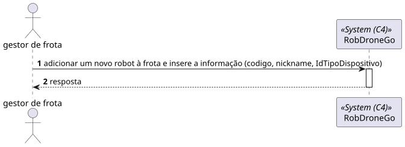
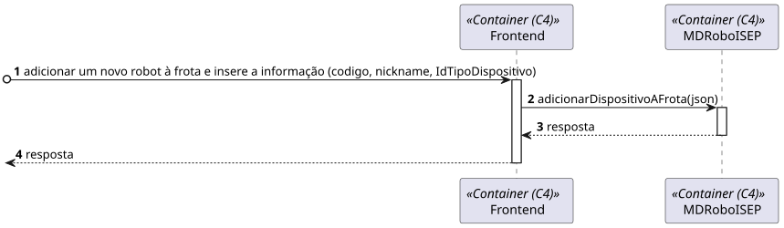
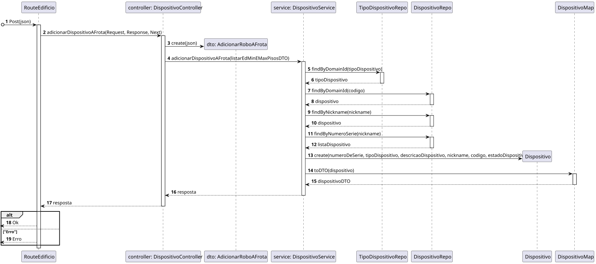

# US 360 - 	Como gestor de frota pretendo adicionar um novo robot à frota indicando o seu tipo, designação, etc.


## 1. Context

É a vez primeira que está a ser desenvolvida.
O gestor de frota quer adicionar um novo robot à frota.

## 2. Requirements

**Main actor**

* N/A

**Interested actors (and why)**

* N/A

**Pre conditions**

* Tem de existir tipo de dispositivos

**Post conditions**

* Tem de ser adicionado um robot à frota 

**Main scenario**
1. Adicionar um novo robot à frota e insere a informação (codigo, nickname, IdTipoDispositivo, descrição)
2. Sistema retorna um robot

**Other scenarios**

**a.** O sistema verifica se o Tipo de dispositivo existe
1. Avisa que o Tipo de dispositivo não existe
2. Termina a use case

## 3. Analysis

**Esclarecimentos do cliente:** </br>

> **Questão:** </br>
Caro cliente,</br>
Os atributos do robot têm algum tipo de formatação/restrição?</br>
Obrigado pela sua atenção,</br>
Grupo 3</br>
**Resposta:** </br>
bom dia,</br>
código identificativo, obrigatório, alfanumerico, max 30 caracteres, único no sistema</br>
nickname, obrigatório, obrigatório, alfanumerico, max 30 caracteres, único no sistema </br>
tipo de robot, obrigatório</br>
número de série, obrigatório, alfanumerico, max 50 caracteres, único para um dado tipo de robot</br>
descrição, opcional, alfanumerico, max. 250 caracteres</br>

> **Questão:** </br>
Boa tarde,</br>
Ao criar um novo robo, qual o estado dele por defeito, isto é, ativo ou inativo?</br>
Tendo em conta a US370 seria ativo por defeito certo?</br>
Obrigado</br>
**Resposta:** </br>
bom dia,</br>
ao criar um robot ele fica no estado ativo</br>


Relevant DM excerpt



## 4. Design

### 4.1. Nível 1

#### 4.1.1 Vista de processos



#### 4.1.2 Vista FÍsica

N/A (Não vai adicionar detalhes relevantes)

#### 4.1.3 Vista Lógica


#### 4.1.4 Vista de Implementação

N/A (Não vai adicionar detalhes relevantes)

#### 4.1.5 Vista de Cenarios


### 4.2 Nível 2

#### 4.2.1 Vista de processos



#### 4.2.2 Vista FÍsica


#### 4.2.3 Vista Lógica


#### 4.2.4 Vista de Implementação


### 4.3. Nível 3 

#### 4.3.1 Vista de processos




#### 4.3.2 Vista FÍsica

N/A (Não vai adicionar detalhes relevantes)

#### 4.3.3 Vista Lógica


#### 4.3.4 Vista de Implementação


### 4.4. Tests

**Test 1:** **

```
```


## 5. Observations
N/A