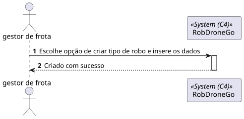
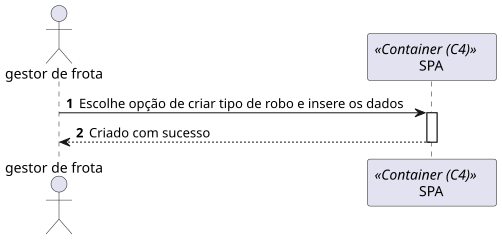
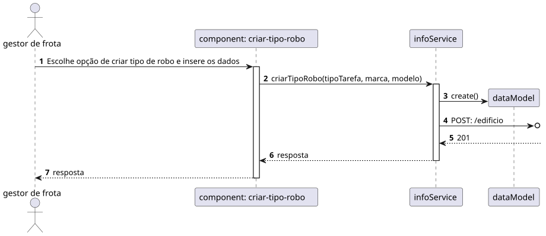

# 1000- Como gestor de Frota pretendo adicionar um novo tipo de robot indicando a sua designação e que tipos de tarefas pode executar da lista prédefinida de tarefas

## 1. Contexto

Esta US tem correspondência com a [US350](../../Sprint_A/US_350/US_350.md) do Sprint A. 
Neste Sprint, é pretendido o desenvolvimento do módulo da SPA (frontend) da US.

Esta US permite criar um tipo de Robot

## 2. Requisitos
* Como gestor de Campus pretendo criar um tipo de Robot

## 2. Análise

**Ator Principal**

* Gestor de frota

**Atores Interessados (e porquê?)**

* Gestor de frota

**Pré-condições**

* N/A

**Pós-condições**

* O Tipo de Robot é persistido

**Cenário Principal**

1. É inserida a informação sobre o Tipo de Robot (Tipo tarefa, marca, modelo)
2. O sistema informa do sucesso ou do insucesso
   
### Questões relevantes ao cliente

### Excerto Relevante do Domínio

## 3. Design
### 3.1.1 Vista Lógica
**Nível 1**

**Nível 2**

**Nível 3**

### 3.1.2. Vista de Processos

**Nível 1**

**Nível 2**

**Nível 3**

### 3.1.3 Vista de Implementação

**Nível 2**

**Nível 3**

### 3.1.4 Vista Física

**Nível 2**

### 3.1.5 Vista de Cenários
**Nível 1**

### 3.2. Testes

## 5. Observations
N/A