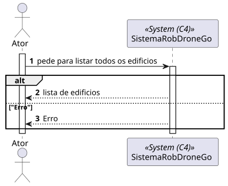
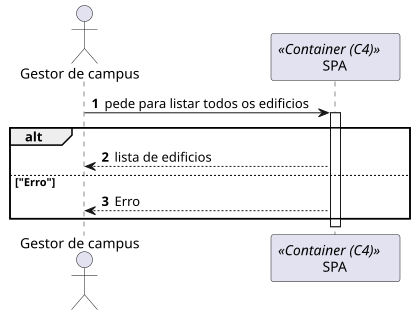
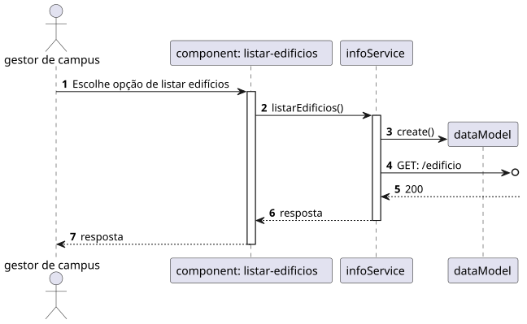

# 1060 - Como gestor de Campus pretendo listar Edifícios

## 1. Contexto

Esta US tem correspondência com a [US170](../../Sprint_A/US_170/US_170.md) do Sprint A. 
Neste Sprint, é pretendido o desenvolvimento do módulo da SPA (frontend) da US.

Esta US permite listar os Edifícios do sistema.

## 2. Requisitos
* 1060 - Como gestor de Campus pretendo listar Edifícios

## 2. Análise

**Ator Principal**

* Gestor de campus

**Atores Interessados (e porquê?)**

* Gestor de campus

**Pré-condições**

* Deverão haver edifícios persistidos

**Pós-condições**

* Os Edifícios serão listados

**Cenário Principal**

1. É requisitada a lista de todos os edifícios
2. O sistema lista todos os edifícios
   
### Questões relevantes ao cliente

* N/A

### Excerto Relevante do Domínio

## 3. Design
### 3.1.1 Vista Lógica
**Nível 1**

**Nível 2**

**Nível 3**

### 3.1.2. Vista de Processos

**Nível 1**

**Nível 2**

**Nível 3**

### 3.1.3 Vista de Implementação

**Nível 2**

**Nível 3**

### 3.1.4 Vista Física

**Nível 2**

### 3.1.5 Vista de Cenários
**Nível 1**

### 3.2. Testes

## 5. Observações
N/A